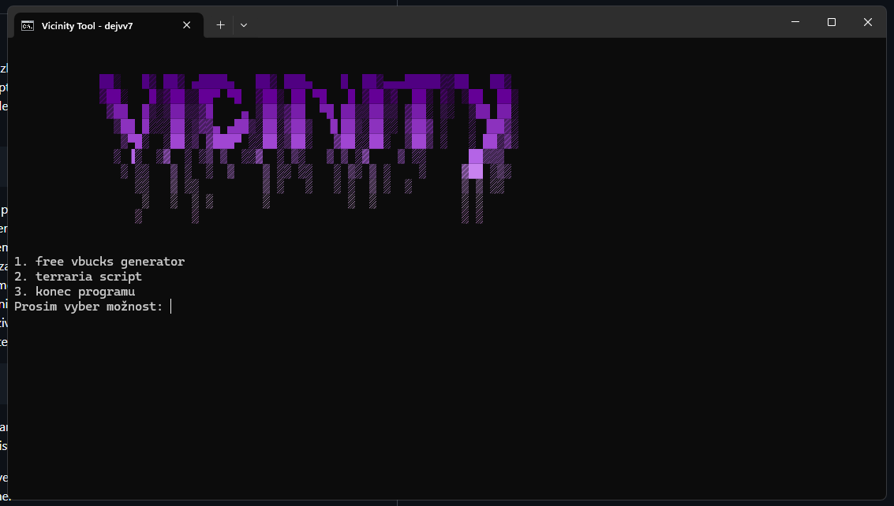

# vicinity_tool
// .bat multitool aplikace
<br><br>

po pouzivani par aplikaci ( ͡° ͜ʖ ͡°) jsem se rozhodl ze zkusim taky udelat takovou navigacni aplikaci v cmd. mluvili nam o tom ve skole co vsechno se da
s command promptem udelat, tak jsem si rikal ze to nebude takove tezke. jako prvni jsem si vybral nejaky ascii art a napsal ho do konzole. konzole mela
nastaveny active character list na spatnem cisle tak jsem ho prepsal na
```
chcp 65001 >nul
```
pote jsem tomu dal nejaky title. rozhodl jsem se to pojmenovat vicinity tool (zadny vyznam to nema, proste me to napadlo jako prvni). na procviceni jsem si dal banner do "funkce" pomoci dvojtecky. udelal jsem si funkci banner, ktera se zavola vzdy kdyz se program zapne. dal jsem banneru barvy a pote jsem pokracoval s funkcnosti cmd a s odkazama na dalsi aplikace. funkcnost jsem udelal za pomoci if statementu, vyresil jsem to tak ze kdyz jsou napsany vsechny moznosti tak uzivatel dostane na vyber si mezi nimi vybrat
a pote se zkontroluje jestli cesta k programu existuje => pokud ano tak se program zpusti a vicinity se zpatky vrati na zacatek kdy ma uzivatel zase volbu / pokud ne tak se vypise error ze cesta nebyla nalezena a uzivatel se zase vrati to zakladni pozice.
v programu je jako posledni moznost ukonceni cmd kde kdyz se input od uzivatele porovna v if statementu => pokud ano
```
exit
```
/ pokud ne tak se vypise error spatny input a program se vrati na zacatek. vysledny a konecny kod pote hodim do repozitare. ted uz akorat dodelam hezke barvy napisu, takze funkcnost hotova, ted uz jen kosmeticke vady.<br><br>
!! k terraria scriptu musi byt stahnuty program steam_idle_master_extended a musi se spravne prepsat cesta. game code by se taky mel vymenit, ale to je individualni a tohle je pouze jen ukazka abych ukazal jak to funguje.

obtiznost: 3/10<br>
shrnuti: bavilo me to, zase neco noveho nez jenom c#, ale nejspis bych to normalne delat nechtel. nebylo to nic tezkeho jen mi to neprislo moc zazivne.
